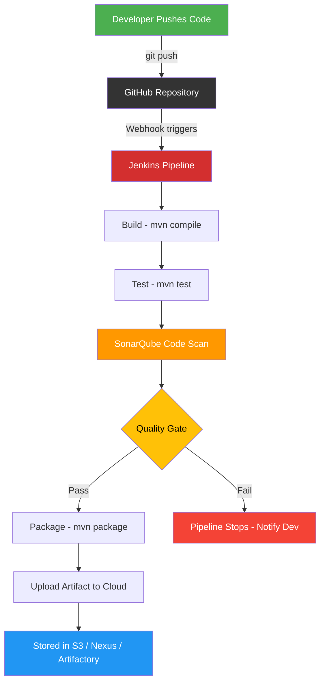
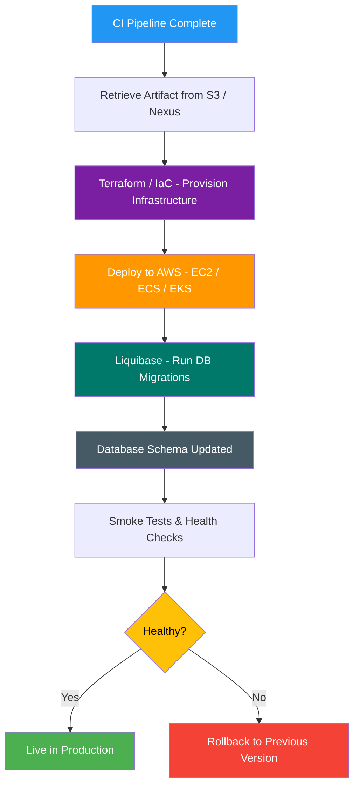
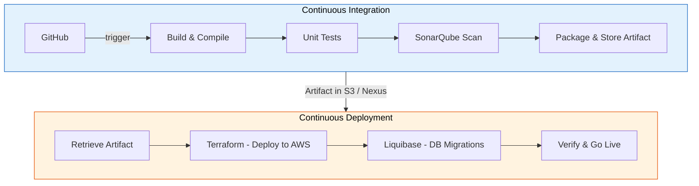

# Module 311: From Code Quality to Continuous Deployment

## One-Day Intensive Lesson Plan

> **Goal:** Learners leave today understanding code quality analysis, CI/CD concepts, and can build a Jenkins pipeline that includes code quality checks — ready for capstone.

---

## Schedule Overview

| Time | Block | Topic | Format |
|------|-------|-------|--------|
| 9:00 – 10:00 | 1 | Code Quality & Static Analysis | Lecture + Discussion |
| 10:00 – 10:15 | — | Break | — |
| 10:15 – 11:15 | 2 | SonarLint Hands-On | Lab |
| 11:15 – 12:00 | 3 | CI/CD Concepts & Jenkins Overview | Lecture + Discussion |
| 12:00 – 1:00 | — | Lunch | — |
| 1:00 – 2:30 | 4 | Jenkins Setup & First Job | Lab |
| 2:30 – 2:45 | — | Break | — |
| 2:45 – 3:45 | 5 | Jenkinsfile & Declarative Pipelines | Lecture + Lab |
| 3:45 – 4:30 | 6 | Capstone Prep: Build a Full Pipeline | Exercise |
| 4:30 – 5:00 | 7 | Wrap-Up & Q&A | Discussion |

---

## Block 1: Code Quality & Static Analysis (9:00 – 10:00)

### Learning Objectives
- Define code quality and explain why it matters
- Identify common code quality issues
- Explain what static code analysis is and how it differs from testing
- Describe Clean Code principles

### 1.1 What is Code Quality? (10 min)

Code quality refers to how well code meets functional and non-functional requirements. High-quality code is:
- **Readable** — other developers can understand it
- **Maintainable** — changes are easy and safe to make
- **Reliable** — it works correctly and handles edge cases
- **Efficient** — it uses resources appropriately
- **Secure** — it doesn't introduce vulnerabilities

**Discussion prompt:** *"Think about code you've written in this program. What made some code easier to come back to than other code?"*

### 1.2 Software Quality Characteristics: ISO/IEC 9126 (5 min)

The ISO/IEC 9126 standard defines six quality characteristics:

| Characteristic | Meaning |
|---------------|---------|
| **Functionality** | Does it do what it's supposed to? |
| **Reliability** | Does it perform consistently without failure? |
| **Usability** | Is it easy for the intended users? |
| **Efficiency** | Does it use resources (time, memory) well? |
| **Maintainability** | Can it be modified easily? |
| **Portability** | Can it run in different environments? |

> **Instructor note:** Don't deep-dive here. The point is that "quality" has been formally defined — it's not just opinion.

### 1.3 Common Code Quality Issues (10 min)

Walk through examples of each:

- **Code smells** — Long methods, duplicated code, god classes
- **Bugs** — Null pointer dereferences, off-by-one errors, resource leaks
- **Vulnerabilities** — SQL injection, hardcoded credentials, insecure deserialization
- **Technical debt** — Shortcuts that make future changes harder

**Live example:** Show a short Java/Python method with 2-3 issues. Ask learners to identify them.

### 1.4 What is Static Code Analysis? (10 min)

Static analysis examines source code **without executing it**. Compare:

| | Static Analysis | Testing |
|---|---|---|
| **When** | Before/during build | After build |
| **What it finds** | Code smells, potential bugs, style violations | Functional defects |
| **Requires running code?** | No | Yes |
| **Coverage** | All code paths (including unreachable) | Only tested paths |

Key point: Static analysis and testing are **complementary**, not replacements.

### 1.5 Clean Code Definition (10 min)

Clean Code (Robert C. Martin) principles:
- **Meaningful names** — variables and methods say what they do
- **Small functions** — each does one thing
- **DRY** — Don't Repeat Yourself
- **YAGNI** — You Aren't Gonna Need It
- **Single Responsibility** — each class/module has one reason to change
- **Boy Scout Rule** — leave code cleaner than you found it

### 1.6 Why Use Code Quality Analysis Tools? (5 min)

- Catch issues **before** code review (saves human time)
- Enforce **consistent standards** across a team
- Track quality **over time** (quality gates)
- Integrate into **CI/CD pipelines** (preview of afternoon!)
- Reduce **technical debt** systematically

### 1.7 Introduction to SonarLint and SonarQube (10 min)

| | SonarLint | SonarQube |
|---|---|---|
| **What** | IDE plugin | Server-based platform |
| **Where it runs** | Developer's machine | CI/CD server or dedicated host |
| **When** | While you type (real-time) | On build / on push |
| **Scope** | Single file you're editing | Entire project |
| **Cost** | Free | Community (free) / paid editions |
| **Analogy** | Spell-check in your editor | Grammarly full-document report |

**Key Features of SonarLint:**
- Real-time detection of bugs, vulnerabilities, and code smells
- Works in IntelliJ, VS Code, Eclipse
- Can connect to SonarQube for team-shared rules
- Zero config to get started

**Key Features of SonarQube:**
- Dashboard with project-level quality metrics
- Quality Gates (pass/fail for builds)
- Rules engine (thousands of rules per language)
- Historical tracking of code quality
- Integration with Jenkins, GitHub, GitLab, etc.

**The term "Rules":** In SonarQube, a Rule is a single coding standard or pattern to check. Rules have severity levels (Blocker, Critical, Major, Minor, Info). Rule sets can be customized per project.

---

## Block 2: SonarLint Hands-On Lab (10:15 – 11:15)

### Learning Objectives
- Install SonarLint in your IDE
- Identify and fix issues flagged by SonarLint

### Lab: Installing and Using SonarLint

#### Step 1: Install SonarLint (10 min)

**For IntelliJ:**
1. File → Settings → Plugins
2. Search "SonarLint"
3. Click Install → Restart IDE

**For VS Code:**
1. Extensions sidebar (Ctrl+Shift+X)
2. Search "SonarLint"
3. Click Install

#### Step 2: See It in Action (15 min)

Create a new Java file (or use an existing project) with intentional issues:

```java
public class Example {
    // Bug: unused variable
    private String name;
    
    // Code smell: empty method
    public void doSomething() {
    }
    
    // Bug: potential null dereference
    public int getLength(String input) {
        return input.length();
    }
    
    // Vulnerability: hardcoded password
    String password = "admin123";
    
    // Code smell: method too complex
    public String classify(int score) {
        if (score >= 90) {
            return "A";
        } else if (score >= 80) {
            return "B";
        } else if (score >= 70) {
            return "C";
        } else if (score >= 60) {
            return "D";
        } else {
            return "F";
        }
    }
}
```

**Tasks for learners:**
1. Open the file and observe the SonarLint warnings (squiggly lines)
2. Hover over each warning — read the explanation
3. Click "More Info" on at least 2 issues to see the full rule description
4. Fix each issue and verify the warning disappears

#### Step 3: Explore Your Own Code (15 min)

Open a project from a previous module and run SonarLint on it.
- How many issues are found?
- What severity are they?
- Fix at least 3 issues.

#### Step 4: Discussion (10 min)

- Which issues surprised you?
- Would you want these checks running automatically on every commit? *(Foreshadow CI/CD)*

---

## Block 3: CI/CD Concepts & Jenkins Overview (11:15 – 12:00)

### Learning Objectives
- Define Continuous Integration, Continuous Delivery, and Continuous Deployment
- Explain how CI/CD fits into DevOps
- Describe Jenkins and its role in CI/CD

### 3.1 DevOps Overview (5 min)

DevOps = Development + Operations working together with shared responsibility.

Key practices: CI/CD, Infrastructure as Code, Monitoring, Collaboration.

> **Instructor note:** Keep this brief — learners should already have DevOps context from prior modules. This is a refresher.

### 3.2 Continuous Integration (CI) (10 min)

**Definition:** Developers merge code to a shared branch frequently (at least daily). Each merge triggers an automated build and test.

**CI Workflow:**
```
Developer pushes code
        ↓
Source Control (Git) detects change
        ↓
CI Server pulls code
        ↓
Build → Test → Static Analysis → Report
        ↓
   Pass ✅ or Fail ❌ (notify developer)
```

**CI Pipeline Diagram:**



**Why CI?**
- Catch integration issues early
- Reduce "merge hell"
- Automated testing ensures nothing is broken
- Fast feedback loop

### 3.3 Continuous Delivery vs. Continuous Deployment (10 min)

| | Continuous Delivery | Continuous Deployment |
|---|---|---|
| **Build & Test** | Automated | Automated |
| **Deploy to staging** | Automated | Automated |
| **Deploy to production** | Manual approval | Automated |
| **Risk** | Lower (human gate) | Requires very mature testing |

**CD Workflow:**
```
CI Pipeline passes
        ↓
Deploy to staging (automated)
        ↓
Acceptance tests (automated)
        ↓
Deploy to production (manual approval OR automatic)
```

**Deployment Pipeline Diagram:**



**End-to-End: CI/CD Full Picture:**



### 3.4 Common CI/CD Tools (5 min)

| Tool | Notes |
|------|-------|
| **Jenkins** | Open source, self-hosted, huge plugin ecosystem |
| **GitHub Actions** | Built into GitHub, YAML-based |
| **GitLab CI** | Built into GitLab |
| **CircleCI** | Cloud-based, fast |
| **Travis CI** | Cloud-based, popular for open source |
| **Azure DevOps** | Microsoft ecosystem |

Today we focus on **Jenkins** — the most widely used, and understanding it makes all others easier.

### 3.5 How is CI/CD Different from DevOps? (5 min)

- DevOps is a **culture and set of practices**
- CI/CD is a **specific practice** within DevOps
- You can do CI/CD without fully adopting DevOps (but it helps)
- DevOps includes monitoring, IaC, incident response — CI/CD is the build/deploy pipeline piece

### 3.6 Jenkins Overview (10 min)

**What is Jenkins?**
- Open-source automation server written in Java
- Supports building, deploying, and automating any project
- 1,800+ plugins for integration with virtually everything
- Runs on any OS with Java

**Process of Jenkins:**
1. Developer pushes code to Git
2. Jenkins detects the change (webhook or polling)
3. Jenkins pulls the code
4. Jenkins executes the pipeline (build → test → analyze → deploy)
5. Jenkins reports results (email, Slack, dashboard)

**How CI is Achieved with Jenkins:**
- **Source Code Management:** Jenkins connects to Git/GitHub/Bitbucket
- **Build Triggers:** Webhooks, polling, manual, scheduled (cron syntax)
- **Build Steps:** Compile, test, package
- **Post-Build Actions:** Notifications, deploy, archive artifacts

---

## Block 4: Jenkins Setup & First Job (1:00 – 2:30)

### Learning Objectives
- Install and configure Jenkins
- Configure Maven in Jenkins
- Create and run a Jenkins job
- Install and use Jenkins plugins

### Lab Part 1: Jenkins Installation (20 min)

#### Option A: Docker (Recommended)
```bash
docker run -d -p 8080:8080 -p 50000:50000 \
  --name jenkins \
  -v jenkins_home:/var/jenkins_home \
  jenkins/jenkins:lts
```

Get initial admin password:
```bash
docker exec jenkins cat /var/jenkins_home/secrets/initialAdminPassword
```

#### Option B: Direct Install
1. Download from https://www.jenkins.io/download/
2. Run installer
3. Navigate to http://localhost:8080
4. Enter initial admin password from install log
5. Install suggested plugins
6. Create admin user

### Lab Part 2: Configure JDK in Jenkins (10 min)

1. Go to **Manage Jenkins → Tools**
2. Scroll to **JDK installations**
3. Click **Add JDK**
4. Uncheck "Install automatically"
5. Name: `Java 21`
6. JAVA_HOME: enter the path to your JDK 21 installation (e.g., `C:\Users\YourName\java\jdk-21.0.10+7`)
7. Save

> **Why this matters:** If your `pom.xml` targets Java 21 but Jenkins uses a different JDK, you'll get `invalid target release: 21`. The `jdk` tool in your Jenkinsfile must match this name exactly.

### Lab Part 3: Configure Maven in Jenkins (10 min)

1. Go to **Manage Jenkins → Tools**
2. Scroll to **Maven installations**
3. Click **Add Maven**
4. Name it `Maven-3` (or similar)
5. Check "Install automatically"
6. Select a recent version
7. Save

### Lab Part 4: Jenkins Plugins (10 min)

Go to **Manage Jenkins → Plugins → Available plugins**

Install these if not already present:
- **Git plugin** (usually pre-installed)
- **Pipeline** (usually pre-installed)
- **Maven Integration**
- **SonarQube Scanner** (needed for Block 6)

> **Instructor note:** Explain that plugins are how Jenkins becomes powerful — there's a plugin for almost everything (SonarQube, Docker, Slack, etc.). Installing the SonarQube Scanner plugin now saves time later.

### Lab Part 5: Create Your First Jenkins Job (25 min)

**Freestyle Job:**

1. Click **New Item**
2. Name: `my-first-job`
3. Select **Freestyle project** → OK
4. **Source Code Management:** Select Git
   - Repository URL: use a public Maven project from GitHub (e.g., a simple Spring Boot starter or your class repo)
5. **Build Triggers:** Poll SCM: `H/5 * * * *` (every 5 min)
6. **Build Steps:** Add → Invoke top-level Maven targets
   - Goals: `clean package`
7. **Post-build Actions:** Archive the artifacts: `target/*.jar`
8. Click **Save** → **Build Now**
9. Check **Console Output** — walk through what happened

**Discussion:** What just happened? Jenkins pulled code, built it, ran tests, and archived the output — automatically!

### Lab Part 6: Scheduled Jenkins Jobs (10 min)

Explain cron syntax in Jenkins:
```
MINUTE HOUR DOM MONTH DOW
  *     *   *    *     *

Examples:
H/15 * * * *     → Every 15 minutes
H 0 * * *        → Daily at midnight
H 8 * * 1-5      → Weekdays at 8am
```

The `H` (hash) spreads load — Jenkins picks a consistent minute based on the job name.

Modify `my-first-job` to build on a schedule of your choice.

---

## Block 5: Jenkinsfile & Declarative Pipelines (2:45 – 3:45)

### Learning Objectives
- Explain the difference between Freestyle jobs and Pipeline jobs
- Write a Declarative Jenkinsfile
- Describe Pipeline stages and steps

### 5.1 Overview of Jenkins Pipeline (10 min)

A **Pipeline** is a suite of plugins that supports defining your build/deploy process as code.

**Why Pipeline over Freestyle?**
- **Version controlled** — Jenkinsfile lives in your repo
- **Reviewable** — changes go through pull requests
- **Durable** — survives Jenkins restarts
- **Multibranch** — different pipelines per branch

### 5.2 Declarative vs. Scripted Pipeline (10 min)

| | Declarative | Scripted |
|---|---|---|
| **Syntax** | Structured, opinionated | Full Groovy scripting |
| **Starts with** | `pipeline { }` | `node { }` |
| **Learning curve** | Lower | Higher |
| **Flexibility** | Covers 90% of use cases | Unlimited |
| **Best for** | Most teams | Complex/custom workflows |

> **Instructor note:** Focus on Declarative. Mention Scripted exists for awareness, but learners don't need it for capstone.

### 5.3 Declarative Pipeline Deep Dive (15 min)

```groovy
pipeline {
    agent any
    
    tools {
        maven 'Maven-3'
        jdk 'Java 21'
    }
    
    stages {
        stage('Checkout') {
            steps {
                git branch: 'main',
                    url: 'https://github.com/your-org/your-repo.git'
            }
        }
        
        stage('Build') {
            steps {
                bat 'mvn clean compile'
            }
        }
        
        stage('Test') {
            steps {
                bat 'mvn test'
            }
        }
        
        stage('Package') {
            steps {
                bat 'mvn package -DskipTests'
            }
        }
    }
    
    post {
        success {
            echo 'Build succeeded!'
            archiveArtifacts artifacts: 'target/*.jar'
        }
        failure {
            echo 'Build failed!'
        }
        always {
            echo 'Pipeline complete.'
        }
    }
}
```

**Walk through each section:**
- `pipeline` — wrapper for everything
- `agent any` — run on any available executor
- `tools` — auto-install and configure tools (`jdk 'Java 21'` must match the name in Jenkins Global Tool Configuration)
- `stages` / `stage` — logical groups of work
- `steps` — actual commands (use `bat` on Windows, `sh` on Linux/Mac)
- `post` — runs after all stages (like finally block)

> **Common pitfall:** If your `pom.xml` targets Java 21 but you forget the `jdk 'Java 21'` line, you'll get `error: invalid target release: 21`. The tool name must match exactly what you configured in Manage Jenkins → Tools.

### 5.4 The Jenkinsfile (10 min)

A **Jenkinsfile** is just a file named `Jenkinsfile` at the root of your repository containing a pipeline definition.

**How to use it:**
1. Create `Jenkinsfile` in your repo root
2. In Jenkins: **New Item → Pipeline**
3. Pipeline section: **Pipeline script from SCM**
4. Point to your Git repo
5. Jenkins finds and executes the Jenkinsfile automatically

**This is the "pipeline as code" pattern** — your build process is versioned alongside your application code.

### Lab: Create a Pipeline Job (15 min)

1. In your project repo, create a `Jenkinsfile` with the Declarative pipeline above
2. Push to Git
3. In Jenkins: **New Item** → name it `my-pipeline` → select **Pipeline**
4. Configure: Pipeline script from SCM → Git → your repo URL
5. **Build Now** → watch the Stage View
6. Compare the experience to the Freestyle job

---

## Block 6: Capstone Prep — Build a Full Pipeline (3:45 – 4:30)

### Learning Objectives
- Combine code quality and CI/CD into a single pipeline
- Understand how SonarQube fits into Jenkins

### The Full Picture

```
Developer pushes code
        ↓
Jenkins detects change
        ↓
┌─────────────────────────────┐
│  Stage: Checkout            │
│  Stage: Build               │
│  Stage: Test                │
│  Stage: Code Quality Scan   │  ← SonarQube/SonarLint
│  Stage: Package             │
│  Stage: Deploy to Staging   │
│  Stage: Deploy to Prod      │  ← (manual approval)
└─────────────────────────────┘
        ↓
   Results Dashboard
```

### Exercise: Set Up SonarQube Locally & Configure Jenkins Integration

#### Step 1: Install SonarQube (15 min)

**Option A: Direct Install (Recommended if Docker is not available)**

1. Download SonarQube Community Edition from https://www.sonarsource.com/products/sonarqube/downloads/
2. Extract the zip to a folder (e.g., `C:\Users\YourName\sonarqube\`)
3. Open a terminal and run:

**Windows:**
```powershell
& "C:\Users\YourName\sonarqube\sonarqube-25.x.x\bin\windows-x86-64\StartSonar.bat"
```

**Mac/Linux:**
```bash
./sonarqube-25.x.x/bin/linux-x86-64/sonar.sh start
```

4. Wait for all three processes to start (Elasticsearch, Web Server, Compute Engine)
5. Navigate to **http://localhost:9000**
6. Log in with default credentials: **admin / admin**
7. You will be prompted to change the password on first login

**Option B: Docker**
```bash
docker run -d --name sonarqube -p 9000:9000 sonarqube:community
```

> **Note:** SonarQube requires Java 17+. It bundles its own JRE, but your system Java should be 17+ as well.

#### Step 2: Generate a SonarQube Token (5 min)

1. In SonarQube (http://localhost:9000), click your **profile avatar** (top-right)
2. Click **"My Account"**
3. Click the **"Security"** tab
4. Under **"Generate Tokens"**:
   - Name: `jenkins`
   - Type: **Global Analysis Token**
   - Click **Generate**
5. **Copy the token** — you won’t be able to see it again!

#### Step 3: Configure SonarQube in Jenkins (10 min)

1. Go to **Jenkins → Manage Jenkins → Credentials**
2. Click **(global)** → **Add Credentials**
   - Kind: **Secret text**
   - Secret: paste the token from Step 2
   - ID: `sonarqube-token`
   - Description: `SonarQube Token`
   - Click **Create**
3. Go to **Jenkins → Manage Jenkins → System**
4. Scroll to **SonarQube servers** → click **Add SonarQube**
   - Name: `SonarQube` (this must match your Jenkinsfile)
   - Server URL: `http://localhost:9000`
   - Server authentication token: select the `sonarqube-token` credential
5. Click **Save**

#### Step 4: Update the Jenkinsfile (15 min)

Extend the Jenkinsfile from Block 5 to include a code quality stage with SonarQube:

```groovy
pipeline {
    agent any
    
    tools {
        maven 'Maven-3'
        jdk 'Java 21'
    }
    
    stages {
        stage('Checkout') {
            steps {
                git branch: 'main',
                    url: 'https://github.com/your-org/your-repo.git'
            }
        }
        
        stage('Build') {
            steps {
                bat 'mvn clean compile'
            }
        }
        
        stage('Test') {
            steps {
                bat 'mvn test'
            }
        }
        
        stage('Code Quality') {
            steps {
                withSonarQubeEnv('SonarQube') {
                    bat 'mvn sonar:sonar'
                }
            }
        }
        
        stage('Package') {
            steps {
                bat 'mvn package -DskipTests'
            }
        }
        
        stage('Deploy to Staging') {
            steps {
                echo 'Deploying to staging environment...'
                // In real life: bat 'deploy-script.bat staging'
            }
        }
        
        stage('Deploy to Production') {
            input {
                message 'Deploy to production?'
                ok 'Yes, deploy!'
            }
            steps {
                echo 'Deploying to production...'
                // In real life: bat 'deploy-script.bat production'
            }
        }
    }
    
    post {
        success {
            echo 'Full pipeline succeeded!'
            archiveArtifacts artifacts: 'target/*.jar'
        }
        failure {
            echo 'Pipeline failed — check logs.'
        }
    }
}
```

**Key things to notice:**
- `jdk 'Java 21'` — ensures Jenkins uses the correct JDK (must match Global Tool Configuration)
- `withSonarQubeEnv('SonarQube')` — injects the SonarQube server URL and token as environment variables so `mvn sonar:sonar` knows where to send results
- The `Code Quality` stage runs **after** tests pass
- The `Deploy to Production` stage uses `input` for **manual approval** (Continuous Delivery pattern)
- `bat` is used for Windows; replace with `sh` on Linux/Mac
- `post` block handles success/failure notifications

### Stretch Goal

After the SonarQube scan completes, visit **http://localhost:9000** and explore the project dashboard:
- How many bugs, vulnerabilities, and code smells were found?
- Did the project pass the default Quality Gate?
- Click into individual issues to see the rule descriptions and suggested fixes
- Compare what SonarQube found vs. what SonarLint showed in your IDE earlier

---

## Block 7: Wrap-Up & Q&A (4:30 – 5:00)

### Key Takeaways

1. **Code quality is measurable** — tools like SonarLint and SonarQube automate detection of bugs, vulnerabilities, and code smells
2. **SonarLint = IDE (local, real-time)** / **SonarQube = Server (project-wide, historical)**
3. **CI = merge + build + test frequently** — Jenkins automates this
4. **CD = automated deployment** — with or without manual gates
5. **Jenkinsfile = pipeline as code** — version your build process alongside your app
6. **The full pipeline ties it all together:** build → test → quality check → deploy

### Capstone Connection

In your capstone project, you should:
- [ ] Have SonarLint installed and use it while coding
- [ ] Have a Jenkinsfile in your repo
- [ ] Your pipeline should include at minimum: build, test, and package stages
- [ ] Bonus: include a code quality stage and deployment stage

### Exit Ticket Questions

1. What is the difference between SonarLint and SonarQube?
2. What is the difference between Continuous Delivery and Continuous Deployment?
3. What is a Jenkinsfile and why is it better than a Freestyle job?
4. Name the stages you would include in a CI/CD pipeline for your capstone project.

---

## Instructor Notes

### Pacing Tips
- **Morning is concept-heavy** — keep energy up with discussion prompts and the hands-on lab
- **Afternoon is lab-heavy** — circulate and help with Jenkins setup issues (Java version mismatches, port conflicts)
- **If running behind:** Skip the SonarQube Docker setup in Block 6, just discuss it conceptually
- **If running ahead:** Have learners set up SonarQube and integrate it into their pipeline

### Common Issues
- Jenkins requires Java 11+ — verify before class
- **JDK mismatch:** If `pom.xml` targets Java 21 but Jenkins uses a different JDK, the build fails with `invalid target release: 21`. Fix: add `jdk 'Java 21'` to the `tools` block and configure the JDK in Jenkins Global Tool Configuration
- **`sh` vs `bat`:** Use `bat` for Windows agents, `sh` for Linux/Mac. Mixing them causes "command not found" errors
- Docker might need WSL2 on Windows
- Port 8080 conflicts (Tomcat, other services) — use `-p 8081:8080` if needed
- SonarQube needs at least 2GB RAM and Java 17+
- SonarQube first startup can take several minutes — wait for all 3 processes (Elasticsearch, Web, Compute Engine) before accessing http://localhost:9000
- **SonarQube token:** The `withSonarQubeEnv('SonarQube')` name must match exactly what's configured in Manage Jenkins → System → SonarQube servers

### Prerequisites
- Git installed and configured
- Java 17+ installed (required for SonarQube; Java 21 recommended for project builds)
- Docker installed (optional) OR direct SonarQube/Jenkins installers
- An IDE with SonarLint support (IntelliJ or VS Code)
- A simple Maven project to use for labs (provide a class repo if needed)
